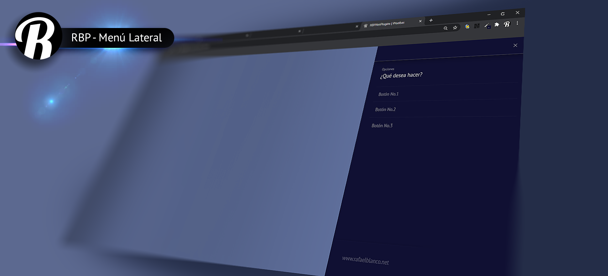

# ¡Bienvenido!
En este sitio encontrarás la codumentación necesaria para que puedas hacer uso correcto del plugin <code>RBPNetPlugins.js</code>.

!> Si deseas proceder con la instalación del Plugin te invitamos a revisar el aparte [instalación inicial](primeros_pasos.md)

> Ten en cuenta que todos los avances de este plugin los puedes encontrar en la correspondiente cuenta de <code>GitHub</code> y estan desarrollados para ser utilizados con <code>Bootstrap</code>, de esta forma encontratás:

* RBP - SmallHelp v.1.0.
* RBP - Ventana Modal v.1.0.
* RBP - Paginador v.1.0.

Te invito a que le des una vista a cada uno de estos desarrollos, los cuales fueron realizados como apoyo a proyectos  personales y ahora estan a la disposición de quienes deseen utlizarlos.

Aquí te muestro un idea visual de lo que cada uno puede llegar a hacer.

# RBP - Ventana Modal v.1.0 

Nuestra ventana es un hermoso y sencillo cuadro flotante que te permitirá ofrecer información con una ventana superpuesta sobre toda la interfaz de tu sitio web y a la que puedes agregarle los botones, títulos, mensajes y acciones necesarias para que esta cumpla con el proposito que le destines en tu proyecto personal.

> <b>Nota importante:</b> Esta ventana es espectacular! y si deseas saber más haz clic [aquí](rbp_ventana_modal.md)

   

# RBP - Paginador v.1.0

Nuestro paginador es un sencillo formulario en <code>Bootstrap</code> que te permite agrupar controles (de formulario) en slides que puedes navegar con un selector de páginas de forma que se pueda controlar el diligenciamiento total del mismo al tiempo que te ofrece opciones para que (por medio de programación adicional) puedas optar por guardar o enviar el contenido del mismo.

> <b>Nota importante:</b> Este formulario, con opción de páginas, es espectucular! y si deseas saber más haz clic [aquí](rbp_paginador.md)

   

# RBP - SmallHelp v.1.0

Nuestro SmallHelp amplia la forma de mostrar los tips en <code>Bootstrap</code> (tambien conocido como <code>Help Texts</code>) disponiendo de un botón con el que puedrás ocultar, o mostrar a tu gusto, información relacionada con el diligenciamiento de campos o controles de formualarios.

> <b>Nota importante:</b> Estos tips son los mejores! y si deseas saber más haz clic [aquí](rbp_small_help.md).

# RBP - MenuLateral v.1.0

Nuestro Menú lateral desarrollado con HTML, CSS, jQuery y GSAP es una forma práctica y útil de generar una barra de opciones al lado derecho de una página web. Se presenta de forma superpuesta, como una ventana modal, de manera de que puedas disponer de una forma organizada y usable de un grupos de opciones, o vínculos, a diferentes partes sitio. Permite muchas opciones entre las que se encuentran: el cambio de color para la personalización del mismo; la adición de tantas opciones como llegues a necesitar con sus respectivas funciones de respuesta (callbacks); la adición de un titulo; un antetitulo y hasta un pié que permite visualizar información relevante como el nombre de dominio de tu sitio web o proyecto. De antemano, te invito a utilizarlo y a que me apoyes para seguir desarrollando recursos como este. 

> <b>Nota importante:</b> Este menú de opciones ¡es espectucular! y gratís, te invito a que lo utilices. Si deseas saber más haz clic [aquí](rbp_menu_lateral.md)

> <b>¡Tu apoyo es muy importante para mi!</b> 
> * Utiliza el siguiente botón si deseas apoyar mi trabajo y asi porder seguir construyendo este tipo de recursos. 
> * Recuerda que estos desarrollos son grátis y estan disponibles para que puedan se utilizados en proyectos web basados en Bootstrap. 

