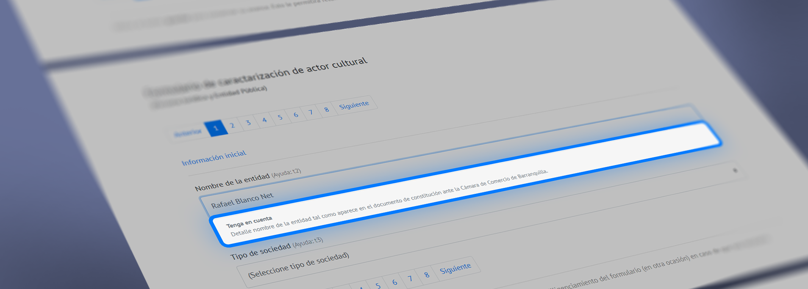
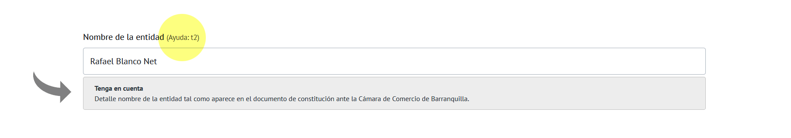

# ¡Bienvenido!
En este sitio encontrarás la codumentación necesaria para que puedas hacer uso correcto del plugin <code>RBPNetPlugins.js</code>.

!> Si deseas proceder con la instalación del Plugin haz clic [aquí](primeros_pasos.md)

> Ten en cuenta que todos los avances de este plugin los puedes encontrar en la correspondiente cuenta de <code>GitHub</code> y estan desarrollados para ser utilizados con <code>Bootstrap 4</code>, de esta forma encontratás:

* RBP - SmallHelp v.1.0.
* RBP - Ventana Modal v.1.0.
* RBP - Paginador v.1.0.

Te invito a que le des una vista a cada uno de estos desarrollos, los cuales fueron realizados como apoyo a proyectos  personales y ahora estan a la disposición de quienes deseen utlizarlos.

Aquí te muestro un idea visual de lo que cada uno puede llegar a hacer.

# RBP - Ventana Modal v.1.0

Una hermoso y sencillo cuadro flotante que te permitirá ofrecer información con una ventana superpuesta sobre toda la interfaz de tu sitio web y a la que puedes agregarle los botones, títulos, mensajes y acciones necesarias para que esta cumpla con el proposito que le destines en tu proyecto personal.

> <b>Nota importante:</b> Esta ventana es espectacular!.

> Si deseas saber más haz clic [aquí](rbp_ventana_modal.md)

# RBP - Paginador v.1.0

Un sencillo formulario en <code>Bootstrap 4</code> que te permite agrupar campos de formulario en slides que puedes navegar con un selector de páginas, de forma que puedan controlar el diligenciamiento del formulario al tiempo que de brinda espacios para que coloques las acciones que desees tales como, guardar o enviar.

> <b>Nota importante:</b> Este formulario con opción de páginas es espectucular!.

> Si deseas saber más haz clic [aquí](rbp_paginador.md)

# RBP - SmallHelp v.1.0

Amplia la forma de mostrar los tips en <code>Bootstrap 4</code> disponiendo de un boton con el que puedes ocultar y mostrar a tu gusto información relacionada con el diligenciamiento de campos de formualarios. Por ahora está disponible para el <code>paginador</code>.

> <b>Nota importante:</b> Estos tips son los mejores!.

> Si deseas saber más haz clic [aquí](rbp_small_help.md)
