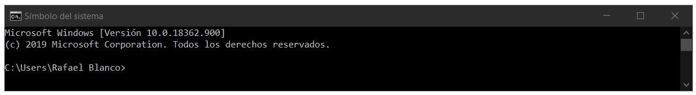
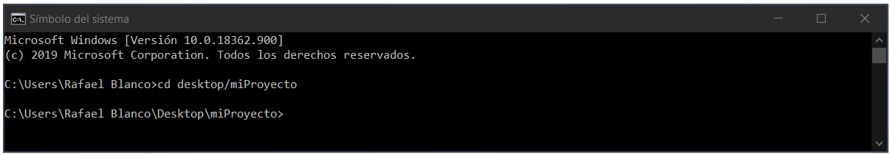
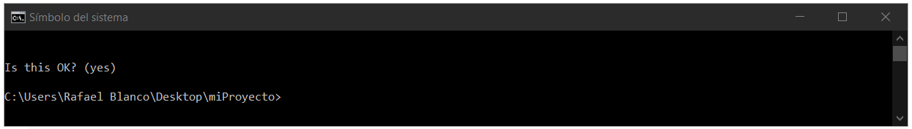
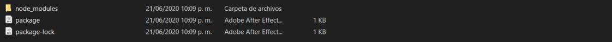
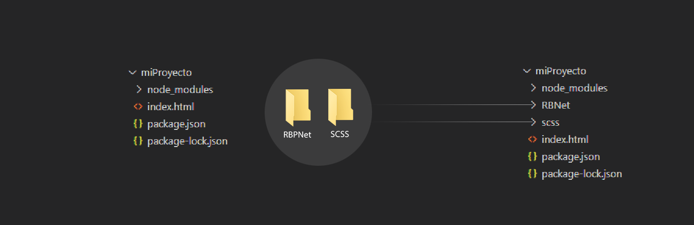

# Instalación inicial

>Gracias por utilizar estos desarrollos, de antemano espero que les puedas sacar mucho provecho.

Primero que todo, debes tomar en consideración que el plugin al que hace referencia esta documentación contiene varios en su interior y quisímos crearlos de esta manera, ya que resultan prácticos y apoyan directamente al motivo principal de desarrollo, nuestro <code>paginador</code>.

?> La instalación es muy sencilla, y parte de la creación de un proyecto de <cocde>Bootstrap</code>, en este sentido debes seguir los siguientes pasos.

## Instalación de Bootstrap

Como base, debes proceder con la instalación de los entornos de ejecución <code>Ruby</code> y <code>Node</code> ambos te permitiran, a su debido tiempo, instalar <code>Bootstrap</code> y de igual forma procesar hojas de estilo CSS con SCSS o SASS.

> * Para instalar <code>Ruby</code> puedes hacerlo en la página oficial haciendo clic [aquí](https://rubyinstaller.org/2020/04/02/rubyinstaller-2.7.1-1-2.6.6-1-2.5.8-1-and-2.4.10-1-released.html).
> * Para instalar <code>Node</code> puedes hacerlo en la página oficial haciendo clic [Acá](https://nodejs.org/es/)

### Creación de carpeta de proyecto

A esto le llamamos la <code>instalación de Bootstrap</code>, en este sentido, todo proyecto debe iniciar con una carpeta que lo contenga, por consiguiente, en alguna ubicación de tu equipo de computo crearemos un directorio denominado <code>miProyecto</code> (puedes nombrarlo como lo desees). Para efectos de esta documentación se recomienda ubicar dicho directorio en el escritorio (<code>desktop</code>) de tu equipo.


Con los entornos de desarrollo <code>Ruby</code> y <code>Node</code> instalados y la carpeta de proyecto lista y ubicada en el escritorio, se debe proceder con la apertura del programa <code>Símbolo del Sistema</code> (en windows), tenga en cuenta que este programa será utilizado para interactuar con los entornos de desarrollo instalados y por medio del ingreso de unas líneas de comando, se podrá crear nuestro proyecto de Bootstrap.

!> Esta documentación está propuesta inicialmente para Windows, en este sentido puedes utilizar para la ejecución de las líneas de comando que se mostrarán a continuación, tanto el <code>Símbolo del sistema</code> como <code>Power Shell</code> o <code>Visual Studio Code</code>. Utiliza uno con el que te sientas a gusto, te recomendamos el primero de estos.

### Apertura del Simbolo del Sistema

Al abrir el <code>Símbolo del Sistema</code> debes visualizar una ventana como la que se muestra a continuación.



Utiliza la siguiente línea de comando para abrir, en el símbolo del sistema, tu carpeta de proyecto.

````
$ cd desktop/miProyecto
````

Esto generaría el siguiente resultado



Luego de esto, por medio del entorno de ejecución <code>Node</code>, ingresamos la siguiente línea de comando para decirle a este que centre sus operaciones apuntando a nuestra carpeta de proyecto.

````
$ npm init
````

!> Este comando te pedira un conjunto de confirmaciones, presiona entrer y acepta todas las configuraciones por defecto hasta que notes que el proceso llego a su fin. El restultado es algo como lo que se muestra en la siguiente imagen.



!>Al terminar, si revisas tu carpeta de proyecto, podrás notar que se ha creado una archivo de nombre <code>package</code>. 

### Instalando Bootstrap

Es en este punto, con <code>node</code> apuntando a la carpeta de proyecto puedes, proceder con la instalación de <code>Bootstrap</code> por medio de la siguiente línea de comando. Ten en cuenta que este paso tiene como objetivo crear todos los ficheros necesarios para que <code>Bootstrap</code> quede disponible en tu proyecto. Y es en este punto donde las cosas se ponen interesantes.

````
$ npm install bootstrap
````

Luego de la instalación, tu carpeta de proyecto debe lucir de la siguiente forma.



!> Felicitación ya instalaste <code>Bootstrap</code> en tu carpeta de proyecto y ahora estas listo para utilizarlo y crear grandes proyectos.

### Consultar versión de Bootstrap

Si deseas verificar la versión instalada de <code>Bootstrap</code> en tu proyecto, utiliza el <code>Símbolo del Sistema</code> y ejecuta la suguiente línea de código.

````
$ npm bootstrap -v 
````

## Creación del index.html

Para efectos del presente documento procederemos a crear una página en formato <code>html</code>, utilizando los pasos especificados en la página oficial de <code>Bootstrap</code>, para más información clic [aquí](https://getbootstrap.com/docs/4.5/getting-started/introduction/#css).

La página oficial de Bootstrap pide seguir los siguientes pasos:

* Adjuntar una hoja de estílos dentro de la etiqueta <code>head</code> y ubicada antes de todos los demás estílos que pueda llegar a tener nuestro <code>index.html</code>.

````hmtl
<link rel="stylesheet" href="https://stackpath.bootstrapcdn.com/bootstrap/4.5.0/css/bootstrap.min.css" integrity="sha384-9aIt2nRpC12Uk9gS9baDl411NQApFmC26EwAOH8WgZl5MYYxFfc+NcPb1dKGj7Sk" crossorigin="anonymous">
````

* Utilizar unos archivos <code>javascripts</code>, ubicados dentro y al final de la etiqueta <code>body</code> de nuestro <code>index.html</code>, ya que muchos de los componentes de Bootstrap los necesitan para que funcionen correctamente.

```` html
<script src="https://code.jquery.com/jquery-3.5.1.slim.min.js" integrity="sha384-DfXdz2htPH0lsSSs5nCTpuj/zy4C+OGpamoFVy38MVBnE+IbbVYUew+OrCXaRkfj" crossorigin="anonymous"></script>
<script src="https://cdn.jsdelivr.net/npm/popper.js@1.16.0/dist/umd/popper.min.js" integrity="sha384-Q6E9RHvbIyZFJoft+2mJbHaEWldlvI9IOYy5n3zV9zzTtmI3UksdQRVvoxMfooAo" crossorigin="anonymous"></script>
<script src="https://stackpath.bootstrapcdn.com/bootstrap/4.5.0/js/bootstrap.min.js" integrity="sha384-OgVRvuATP1z7JjHLkuOU7Xw704+h835Lr+6QL9UvYjZE3Ipu6Tp75j7Bh/kR0JKI" crossorigin="anonymous"></script>
````

!> El primero de estos <code>scripts</code> puede ser reemplazado por la última versión de <code>jQuery</code> en caso de ser necesario.

?> <strong>Nota:</strong> por efectos del uso de <code>RBPNetPlugins.js</code> solo agregaremos los <code>scripts</code> en nuestro <code>body</code> ignorando la hoja de estilos, debido a que para nuestro proyecto, generaremos con <code>sass</code> nuestra propia versión de <code>bootstrap.min.css</code>

Por todo lo anterior, nuestra platilla inicial quedaría de la siguiente forma.

````html
<!DOCTYPE html>
<html lang="en">
<head>
    <meta charset="UTF-8">
    <meta name="viewport" content="width=device-width, initial-scale=1.0">
    <!-- ADICIONALES AQUÍ -->
    <title>Mi Proyecto - RafaelBlancoNet Plugins</title>
</head>
<body>

    <script src="https://code.jquery.com/jquery-3.5.1.slim.min.js" integrity="sha384-DfXdz2htPH0lsSSs5nCTpuj/zy4C+OGpamoFVy38MVBnE+IbbVYUew+OrCXaRkfj" crossorigin="anonymous"></script>
    <!-- ADICIONALES ACÁ -->
    <script src="https://cdn.jsdelivr.net/npm/popper.js@1.16.0/dist/umd/popper.min.js" integrity="sha384-Q6E9RHvbIyZFJoft+2mJbHaEWldlvI9IOYy5n3zV9zzTtmI3UksdQRVvoxMfooAo" crossorigin="anonymous"></script>
    <script src="https://stackpath.bootstrapcdn.com/bootstrap/4.5.0/js/bootstrap.min.js" integrity="sha384-OgVRvuATP1z7JjHLkuOU7Xw704+h835Lr+6QL9UvYjZE3Ipu6Tp75j7Bh/kR0JKI" crossorigin="anonymous"></script>
</body>
</html>
````

Como se puede ver en la plantilla anterior, se hace necesario agregar unos <code>adicionales</code> para que nuestro plugin funcione correctamente. De esta forma, procederemos a agregar las siguientes líneas.

````html
<!DOCTYPE html>
<html lang="en">
<head>
    <meta charset="UTF-8">
    <meta name="viewport" content="width=device-width, initial-scale=1.0">

    <link rel="stylesheet" href="scss/main.css">
    <link rel="stylesheet" href="RBNet/sass/rbp-main.css">
    
    <title>Mi Proyecto - RafaelBlancoNet Plugins</title>
</head>
<body>
    
    <script src="https://code.jquery.com/jquery-3.5.1.slim.min.js" integrity="sha384-DfXdz2htPH0lsSSs5nCTpuj/zy4C+OGpamoFVy38MVBnE+IbbVYUew+OrCXaRkfj" crossorigin="anonymous"></script>
    
    <script src="https://cdnjs.cloudflare.com/ajax/libs/gsap/3.3.4/gsap.min.js"></script>
    <script src="RBNet/plugins/RBNetPlugins.js"></script>
    
    <script src="https://cdn.jsdelivr.net/npm/popper.js@1.16.0/dist/umd/popper.min.js" integrity="sha384-Q6E9RHvbIyZFJoft+2mJbHaEWldlvI9IOYy5n3zV9zzTtmI3UksdQRVvoxMfooAo" crossorigin="anonymous"></script>
    <script src="https://stackpath.bootstrapcdn.com/bootstrap/4.5.0/js/bootstrap.min.js" integrity="sha384-OgVRvuATP1z7JjHLkuOU7Xw704+h835Lr+6QL9UvYjZE3Ipu6Tp75j7Bh/kR0JKI" crossorigin="anonymous"></script>
</body>
</html>
````

Lo anterior hace referencia a:

* <code>main.css</code>: nuestro nuevo <code>bootstrap.min.css</code>, incluye modificaciones al tema por defecto de Bootstrap.
* <code>rbp-main.css</code>: los estilos para la parte visual de nuestro plugin.
* <code>gsap.min.js</code>: libreria GSAP para gestionar las animaciones de nuestro plugin.
* <code>RBPNetPlugins.js</code>: nuestro plugin.

## Descarga de los archivos del plugin.

!> Para que estas nuevas rutas tengan efecto, debes descargar los archivos necesarios para agregar a tu proyecto, estos los puedes encontrar en nuestro repositorio alojado e GitHub: [clic aquí para descargar]().



Como puedes ver en la imagen necesitas solo dos carpetas:

* <code>RBPNet</code>: Archivos correspondientes al plugin.
* <code>y CSCC</code>: Hojas de estilos SCSS preprocesadas para gestionar la apariencia visual a algunos componentes de bootstraps.

> Si aún no haz descargado nuestro plugin te invitamos a hacer clic aquí [puedes hacer clic aquí]().