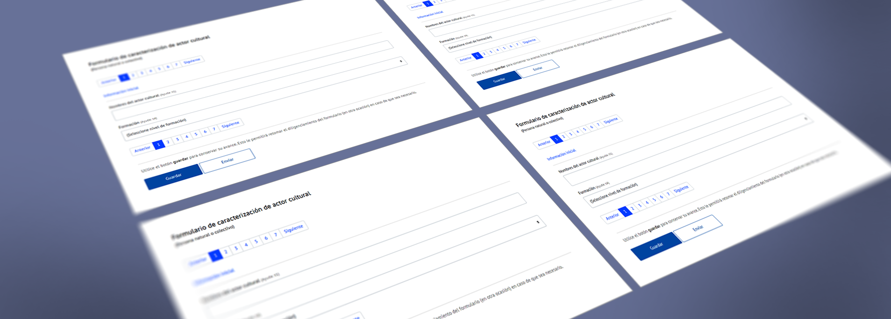
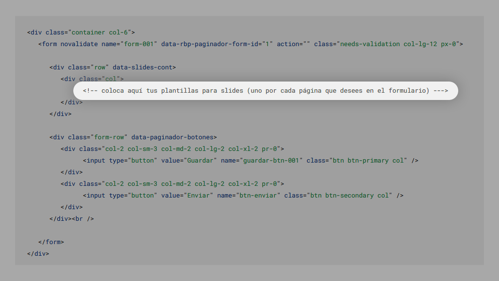
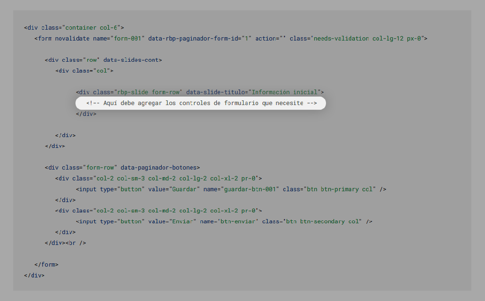

# RBP Paginador

Nuestro paginador es un sencillo formulario en <code>Bootstrap</code> que te permite agrupar controles (de formulario) en slides que puedes navegar con un selector de páginas de forma que se pueda controlar el diligenciamiento total del mismo, al tiempo que te ofrece opciones para que (por medio de programación adicional) puedas optar por guardar o enviar su contenido.

## ¿De qué se trata?

> Es un formulario organizado por páginas y algo más ...



Nuestro paginador está creado para ser utilziado con <code>Bootstrap</code> y permite la creación de un formulario organizado por páginas, de forma que se pueda manipular: el número de controles del formulario; el envío y validación del mismo; y de igual forma la organización estructural de su contenido, por medio de slides, los cuales pueden ser navegados en forma de páginas. De alli el nombre. y como adicional te ofrece un dato de avance para que puedas monitorear el porcentaje de diligenciamiento mientras interactuas con el.

?> <b>Nota:</b> Para poder utilizar nuestro <code>paginador</code> es necesario que te remitas al aparte [instalación inicial](primeros_pasos.md), de esta forma podrás contar con todos los requerimientos iniciales para el uso correcto del mismo.

## ¿Cómo funciona?

Su funcionamiento es muy sencillo, necesitas un formulario, notas que tiene muchos controles o campos y usas nuestro paginador.

!> Debes tener en cuenta que para su correcto funcionamiento, este plugin utiliza los métodos: <code>$.fn.alertar</code> y <code>$.fn.smallHelp</code>, los cuales vienen incluidos en el plugin <code>RBPNetPlugins.min.js</code>.

!> Si deseas descargar nuestro plugin te invitamos a hacerlo en nuestro repositorio en GitHub haciendo clic [aquí](https://github.com/rafaelblanco00/RBPNetPlugins).

## ¿Cómo agregarlo?

Agregarlo es muy sencillo, luego de haberte remitido al aparte [instalación inicial](primeros_pasos.md), vas a necesitar de una <code>plantilla html</code>, la cual es una porción de código de marcación (mostrada a continuación) que será utilizada como referencia para controlar e identificar, en tu HTML o tu proyecto a nuestro formulario, al formulario.

```html
<!-- Plantilla inicial para el paginador -->
<form novalidate name="form-001" data-rbp-paginador-form-id="1" action="" class="needs-validation col-lg-12 px-0">
   <div class="row" data-slides-cont>
      <div class="col">
            <!-- coloca aquí tus slides (uno por cada página que desees en el formulario) --->
      </div>
   </div>

   <div class="form-row" data-paginador-botones>
         <div class="col-12 col-lg-5">
            <button class="btn btn-primary w-100" name="guardar-btn-001"
               type="button">Guardar</button>
            <div class="btn-group w-100" role="group" aria-label="Button group">
               <button class="btn btn-secondary" name="btn-revisar"
                     type="button">Revisar</button>
               <button class="btn btn-secondary" name="btn-enviar"
                     type="button">Enviar</button>
            </div>
         </div>
   </div><br />

</form>
```

> <strong>Nota:</strong> puedes encerrar tus formularios con la siguiente etiqueta para poder controlar, por medio de <code>Bootstrap</code> el ancho del formulario con el uso de las clases de control compositivo con base en columnas denominadas <code>grids</code>.

````html
<!-- contenedor a seis columnas de ancho -->
<div class="container col-6">
   <!-- coloque aquí su plantilla de formulario -->
</div>
````
> Lo anterior es m,uy útil para lograr que el formulario luzca atractivo a la vista y no tome todo el ancho del navegador. Este paso puede ser omitido y no afecta el funcionamiento de nuestro paginador.

## Plantilla HTML

Teniendo en cuenta lo anterior, nuestra plantilla quedaría de la siguiente forma.

````html
<div class="container col-6">
   <form novalidate name="form-001" data-rbp-paginador-form-id="1" action="" class="needs-validation col-lg-12 px-0">

      <div class="row" data-slides-cont>
         <div class="col">

               <!-- coloca aquí tus plantillas para slides (uno por cada página que desees en el formulario) --->

         </div>
      </div>

      <div class="form-row" data-paginador-botones>
            <div class="col-12 col-lg-5">
               <button class="btn btn-primary w-100" name="guardar-btn-001"
                  type="button">Guardar</button>
               <div class="btn-group w-100" role="group" aria-label="Button group">
                  <button class="btn btn-secondary" name="btn-revisar"
                        type="button">Revisar</button>
                  <button class="btn btn-secondary" name="btn-enviar"
                        type="button">Enviar</button>
               </div>
            </div>
      </div><br />

   </form>
</div>
````

## ¿Cómo lo ejecuto?

Luego de haber adjuntado el plugin y haber agregado la plantilla al cuerpo (body) de su página, el siguiente paso es la ejecución del script que se encargará de controlar todo el funcionamiento.

!> Tenga en cuenta que este código JS (jQuery) debe estar definido como una <code>sentencia</code>, del parámetro <code>function</code>, del método <code>ready</code>, de la declaración inicial de <cdoe>jQuery</code>, como se muestra a continuación.

```js
// Inicialización de jQuery para el documento actual
$(document).ready(function () {
   // en esta posición debe ejecutar el paginador
});
```

Teniendo esto en cuenta, se ejecuta el paginador por medio del siguiente código.

```js
// ejecuación del paginador
$("[name='tu_nombre_de_formulario']").paginador();
```

Como el nombre del formulario de la plantilla es <ocde>form-001</code> el código anterior quedaría de la siguiente forma.

```js
// ejecuación del paginador para un formulario de nombre form-001
$("[name='form-001']").paginador();
```

!> Tenga en cuenta que se debe activar el <code>smallHelp</code> para los controles del formulario.

```js
// activación de smallHelp para los controles del formulario
$("[name='form-001']").smallHelp();
```

### Ejecución

Por todo lo anterior, nuestra código para la ejecuación de nuestro paginador seria el siguiente:

```js
// Plantilla jQuery para ejecución del paginador
$(document).ready(function () {
   $("[name='form-001']").smallHelp();
   $("[name='form-001']").paginador();
});
```

Si eres desarrollador, te invitamos a utilizar las propiedades <code>ver_que_tip</code> y <code>ver_que_control_name</code> para <code>smallHelp</code> y el <code>paginador</code> respectivamente. De esta forma, podrás visualizar el indice <code>.json</code> de los tips utilizados por los controles de formulario presentes en el paginador, y por el otro lado, los nombres <code>atributo: name<code> de cada uno de los controles de formalario presentes en el paginador.

```js
// Plantilla jQuery para ejecución del paginador con ayudas visuales para desarrolladores
$(document).ready(function () {
   $("[name='form-001']").smallHelp.defaults.ver_que_tip = false;
   $("[name='form-001']").smallHelp();

   $("[name='form-001']").paginador.defaults.ver_que_control_name = false;
   $("[name='form-001']").paginador();
});
```

!> Tenga en cuenta que nuestro <code>paginador</code> y nuestro <cdoe>smallHelp</code> debe ser ejecutado con un selector <code>jQuery</code> que apunte a una plantilla (formulario) para que de esta forma, todo el control del método <code>paginador();</code>, recaiga sobre el formulario especificado.

## Aja! ¿Y cómo agrego páginas?

En el paginador cada pagina es denominada <code>slide</code>, agregar páginas (slides) es muy sencillo, para esto se necesita de una plantilla que te permitirá agregar campos y grupos de campos como lo desees.

> Plantilla para agregar una página o slide.

```html
<!-- plantilla para agregar slides al paginador -->
<div class="rbp-slide form-row" data-slide-titulo="Información inicial">
   <!-- Aquí debe agregar los controles de formulario que necesite -->
</div>
```
Los <code>slides</code> deben ser agregados en la posición determinada para ellos en la plantilla inicial, como lo muestra la siguiente imagen:



Al gregar un slide a nuestra plantilla inicial el resultado debe ser el siguiente:

````html
<!-- Plantilla de un paginador a 6 columnas de ancho, de una página y sin controles de formularios -->
<div class="container col-6">
   <form novalidate name="form-001" data-rbp-paginador-form-id="1" action="" class="needs-validation col-lg-12 px-0">

      <div class="row" data-slides-cont>
         <div class="col">

               <div class="rbp-slide form-row" data-slide-titulo="Información inicial">

                  <!-- Aquí debe agregar los controles de formulario que necesite -->

               </div>

         </div>
      </div>

      <div class="form-row" data-paginador-botones>
            <div class="col-12 col-lg-5">
               <button class="btn btn-primary w-100" name="guardar-btn-001"
                  type="button">Guardar</button>
               <div class="btn-group w-100" role="group" aria-label="Button group">
                  <button class="btn btn-secondary" name="btn-revisar"
                        type="button">Revisar</button>
                  <button class="btn btn-secondary" name="btn-enviar"
                        type="button">Enviar</button>
               </div>
            </div>
      </div><br />

   </form>
</div>
````

> Tenga en cuenta que usted puede agregar, dentro de cada slide agregado, controles de formuario tales como:
>
> -  Inputs
> -  Selects
> -  y Textareas.

Cada uno de estos controles de formulario (inputs, selects, textarea, etc) deben ir ubicados dentro la de una plantilla de slides como lo muestra la imagen a continuación:



!> Debe agregar dentro de la plantilla de slides, tantos controles de formulario como considere necesario, en este sentido, si un slide cuenta con 5 controles de formulario significa que dicho slide representa una página de 5 controles. Al agregar mas de un slide, nuestro paginador mostrará el control de páginas, cuando el formulario solo tiene un solo slide el control de páginas permanece oculto.

## ¿Cómo agregar controles de formulario?

Para agregar controles de formulario desbes utilizar las plantillas que se muestran a continuación.

### Agregando INPUTs

> La siguiente plantilla te permitirá agregar control de formulario input tipo <code>text</code>.

```html
<div class="form-group col-12 col-sm-12 col-md-12 col-lg-12 col-xl-12">
   <label for="">Etiqueta del control de formulario</label>
   <input name="" required type="text" class="form-control" />
   <small class="form-text text-muted" data-rbp-small-help="t1">Tip relacionado con lo que sugiere la etiqueta del control de formulario.</small>
</div>
```

### Agregando SELECTs

> La siguiente plantilla terpemitirá agregar un control de formulario tipo <code>select</code>

```html
<div class="form-group col-12 col-sm-12 col-md-12 col-lg-12 col-xl-12">
   <label for="">Etiqueta del control de formulario</label>
   <select name="" required class="custom-select">
      <option value="">(No hay selección)</option>
      <option value="">__OPCION__</option>
   </select>
   <small class="form-text text-muted" data-rbp-small-help="t1">Tip relacionado con lo que sugiere la etiqueta del control de formulario.</small>
</div>
```

<br>

### Agregando TEXTAREAs

> La siguiente plantilla te permitirá agregar un control de formulario tipo <code>textarea</code>

```html
<div class="form-group col-lg-12">
   <label for="">Etiqueta del control de formulario</label>
   <textarea name="" required maxlength="250" class="form-control" cols="30" rows="5"></textarea>
   <small class="form-text text-muted" data-rbp-small-help="t1">Tip relacionado con lo que sugiere la etiqueta del control de formulario.</small>
</div>
```
### Plantilla de prueba

### Ejemplo 1: formulario a 1 páginas

Si agregamos estos tres controles de formulario en nuestra plantilla general el resultado deberia ser el siguiente:

````html
<!-- Plantilla de prueba -->
<!-- Paginador a 6 columnas de ancho, de una página con 3 controles de formulario (1 input, 1 select y 1 textarea) -->
<div class="container col-6">
   <form novalidate name="form-001" data-rbp-paginador-form-id="1" action="" class="needs-validation col-lg-12 px-0">

      <div class="row" data-slides-cont>
         <div class="col">

               <div class="rbp-slide form-row" data-slide-titulo="Información inicial">
                  
                  <!-- control de formulario tipo input -->
                  <div class="form-group col-12 col-sm-12 col-md-12 col-lg-12 col-xl-12">
                     <label for="">Etiqueta del control de formulario</label>
                     <input required type="text" class="form-control" />
                     <small class="form-text text-muted" data-rbp-small-help="t1">Tip relacionado con lo que sugiere la etiqueta del control de formulario.</small>
                  </div>

                  <!-- control de formulario tipo input -->
                  <div class="form-group col-12 col-sm-12 col-md-12 col-lg-12 col-xl-12">
                     <label for="">Etiqueta del control de formulario</label>
                     <select required class="custom-select">
                        <option value="">(No hay selección)</option>
                        <option value="">__OPCION__</option>
                     </select>
                     <small class="form-text text-muted" data-rbp-small-help="t1">Tip relacionado con lo que sugiere la etiqueta del control de formulario.</small>
                  </div>

                  <!-- control de formulario tipo input -->
                  <div class="form-group col-lg-12">
                     <label for="">Etiqueta del control de formulario</label>
                     <textarea required maxlength="250" class="form-control" cols="30" rows="5"></textarea>
                     <small class="form-text text-muted" data-rbp-small-help="t1">Tip relacionado con lo que sugiere la etiqueta del control de formulario.</small>
                  </div>

               </div>

         </div>
      </div>

      <div class="form-row" data-paginador-botones>
            <div class="col-12 col-lg-5">
               <button class="btn btn-primary w-100" name="guardar-btn-001"
                  type="button">Guardar</button>
               <div class="btn-group w-100" role="group" aria-label="Button group">
                  <button class="btn btn-secondary" name="btn-revisar"
                        type="button">Revisar</button>
                  <button class="btn btn-secondary" name="btn-enviar"
                        type="button">Enviar</button>
               </div>
            </div>
      </div><br />

   </form>
</div>
````
### Ejemplo 2: formulario a 2 páginas

Si agregamos un segundo <code>slide</code> con otros controles de formulario como dos campos de texto, el resultado sería el siguiente y en este caso, el paginador estaria visible ya que el formulario cuenta con mas de una página:

````html
<!-- Plantilla de prueba -->
<!-- Paginador a 6 columnas de ancho, de una página con 3 controles de formulario (1 input, 1 select y 1 textarea) -->
<div class="container col-6">
   <form novalidate name="form-001" data-rbp-paginador-form-id="1" action="" class="needs-validation col-lg-12 px-0">

      <div class="row" data-slides-cont>
         <div class="col">

               <!-- slide o página no.1 con 3 controles de formulario -->
               <div class="rbp-slide form-row" data-slide-titulo="Información inicial">
                  
                  <!-- control de formulario tipo input -->
                  <div class="form-group col-12 col-sm-12 col-md-12 col-lg-12 col-xl-12">
                     <label for="">Etiqueta del control de formulario</label>
                     <input name="" required type="text" class="form-control" />
                     <small class="form-text text-muted" data-rbp-small-help="t1">Tip relacionado con lo que sugiere la etiqueta del control de formulario.</small>
                  </div>

                  <!-- control de formulario tipo input -->
                  <div class="form-group col-12 col-sm-12 col-md-12 col-lg-12 col-xl-12">
                     <label for="">Etiqueta del control de formulario</label>
                     <select name="" required class="custom-select">
                        <option value="">(No hay selección)</option>
                        <option value="">__OPCION__</option>
                     </select>
                     <small class="form-text text-muted" data-rbp-small-help="t1">Tip relacionado con lo que sugiere la etiqueta del control de formulario.</small>
                  </div>

                  <!-- control de formulario tipo input -->
                  <div class="form-group col-lg-12">
                     <label for="">Etiqueta del control de formulario</label>
                     <textarea name="" required maxlength="250" class="form-control" cols="30" rows="5"></textarea>
                     <small class="form-text text-muted" data-rbp-small-help="t1">Tip relacionado con lo que sugiere la etiqueta del control de formulario.</small>
                  </div>

               </div>

               <!-- slide o página no.2 con dos controles de formulario-->
               <div class="rbp-slide form-row" data-slide-titulo="Información inicial">
                  
                  <!-- control de formulario tipo input -->
                  <div class="form-group col-12 col-sm-12 col-md-12 col-lg-12 col-xl-12">
                     <label for="">Etiqueta del control de formulario</label>
                     <input name="" required type="text" class="form-control" />
                     <small class="form-text text-muted" data-rbp-small-help="t1">Tip relacionado con lo que sugiere la etiqueta del control de formulario.</small>
                  </div>

                  <!-- control de formulario tipo input -->
                  <div class="form-group col-lg-12">
                     <label for="">Etiqueta del control de formulario</label>
                     <textarea name="" required maxlength="250" class="form-control" cols="30" rows="5"></textarea>
                     <small class="form-text text-muted" data-rbp-small-help="t1">Tip relacionado con lo que sugiere la etiqueta del control de formulario.</small>
                  </div>

               </div>

         </div>
      </div>

      <div class="form-row" data-paginador-botones>
            <div class="col-12 col-lg-5">
               <button class="btn btn-primary w-100" name="guardar-btn-001"
                  type="button">Guardar</button>
               <div class="btn-group w-100" role="group" aria-label="Button group">
                  <button class="btn btn-secondary" name="btn-revisar"
                        type="button">Revisar</button>
                  <button class="btn btn-secondary" name="btn-enviar"
                        type="button">Enviar</button>
               </div>
            </div>
      </div><br />

   </form>
</div>
````

!> Tenga en cuenta que nuestro paginador utilizar <code>smallHelp</code> para mostrar textos de ayuda en cada uno de los controles de formualrio, de esta forma, si desea saber mas del control de nuestro <code>smallHelp</code> te invitamos a revisar la documentación relacionada haciendo clic [aquí](rbp_small_help.md)

<br>

Como puedes ver, nuestro <code>paginador</code> es de fácil uso y ayuda a resolver el problema de creación y control de formularios con grandes volémenes de información. Si deseas conocer más de nuestro plugin haz clic [aquí](README.md).

> <b>¡Tu apoyo es muy importante para mi!</b><br>
> * Utiliza el siguiente botón si deseas apoyar mi trabajo y asi porder seguir construyendo este tipo de recursos. 
> * Recuerda que estos desarrollos son grátis y estan disponibles para que puedan se utilizados en proyectos web basados en Bootstrap. 

<a target="_blank" href="https://www.buymeacoffee.com/rafaelblanco"></a>