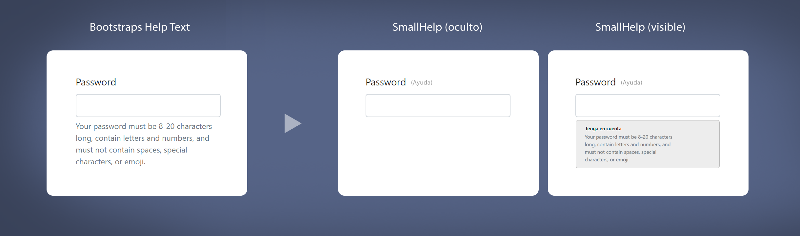

# RBP Small Help

Nuestro <code>SmallHelp</code> es un plugin que te permitirá mostrar, de una forma diferente, los textos de ayuda que pueden ser asociados a controles de formularios en <code>Bootstrap</code>. En el siguiente aparte podrás ver como lucen los textos de ayuda ([help texts](https://getbootstrap.com/docs/4.5/components/forms/?#help-text)) agregados por defecto en <code>Bootstrap</code> y su contraste con respecto al resultado después de aplicar nuestro plugin.

## ¿Como funciona?

De esta forma, este es el resultado que obtendrias si después de aplicar nuestro <code>SmallHelp</code>



Como se puede notar, <code>SmallHelp</code> oculta el texto de ayuda para evitar generar ruido visual cuando estos son utilizados en controles de formulario, de esta forma, <code>SmallHelp</code> agrega un botón de ayuda inmediatamente después de la etiqueta del control de formulario y le permite al usuario visualizar estos <code> textos de ayuda </code> cuando lo deseé. El comportamiento de este es el mismo ofrecido por <code>Bootstraps Help Texts</code>, sin embargo, al activar el plugin se puede agregar un título que permite contextualizar a quienes interactúen con estos controles de formularios y de esta forma poder generar un contexto.

## ¿Cómo utilizarlo?

Para utilizar nuestro <code>SmallHelp</code> necesitas de una plantilla html, que utiliza la misma metodología propuesta por <code>Bootstrap</code>, como se muestra a continuación.

````html
<!-- Plantilla para input tipo -password- de bootstrap -->
<label for="inputPassword5">Password</label>
<input type="password" id="inputPassword5" class="form-control" aria-describedby="passwordHelpBlock">
<small id="passwordHelpBlock" class="form-text text-muted">
  Your password must be 8-20 characters long, contain letters and numbers, and must not contain spaces, special characters, or emoji.
</small>
````

?> Para que funcione correctamente, la plantilla debe estar envuelta en un formulario al que debes nombrar con el atributo <code>name</code> como se muestra continuación.

````html
<!-- Plantilla envuelta en formulario de nombre formulario-1 -->
<form name="formulario-1">
    <label for="inputPassword5">Password</label>
    <input type="password" id="inputPassword5" class="form-control" aria-describedby="passwordHelpBlock">
    <small id="passwordHelpBlock" class="form-text text-muted">
        Your password must be 8-20 characters long, contain letters and numbers, and must not contain spaces, special characters, or emoji.
    </small>
</form>
````

?> Para finalizar y no menos importante, debes agregar el atributo de control <code>data-rbp-small-help</code> a la etiqueta <code><small></code> de la plantilla.

````html
<!-- Etiqueta <small> con atributo data-rbp-small-help -->
<form name="formulario-1">
    <label for="inputPassword5">Password</label>
    <input type="password" id="inputPassword5" class="form-control" aria-describedby="passwordHelpBlock">
    <small id="passwordHelpBlock" class="form-text text-muted" data-rbp-small-help="__SMALL_HELP_INDICE__">
        Your password must be 8-20 characters long, contain letters and numbers, and must not contain spaces, special characters, or emoji.
    </small>
</form>
````

!> Tenga en cuenta que <code>data-rbp-small-help</code> hace referencia a un indice que representa, en un archivo <code>json</code> externo, a un texto de ayuda específico. Estos textos de ayuda viene nombrados secuenciamente de la siguiente forma: <code>t1</code>, <code>t2</code>,<code>(...)</code>, <code>tn</code>. Y te permitirán de una forma práctica, agregar todos los textos de ayuda que requieras, desde un solo archivo y con la posibilidad de escribir en formato <code>html</code>.

De esta forma le especificarás al control de formulario que permita ser controlado por nuestro <code>SmallHelp</code> y que de igual forma permita visualizar el texto de ayuda <code>t1</code>, que se encuentra especificado desde un archivo externo <code>en formato .json</code>, que contendrá todos los textos de ayuda que llegues a necesitar.

### Plantilla

Por todo lo anterior, la plantilla quedaría de la siguiente forma:

````html
<!-- RBPNetPlugin > SmallHelp para Bootstrap - Plantilla- -->

<form name="formulario-1">
    <label for="inputPassword5">Password</label>
    <input type="password" id="inputPassword5" class="form-control" aria-describedby="passwordHelpBlock">
    <small id="passwordHelpBlock" class="form-text text-muted" data-rbp-small-help="t1">
        Your password must be 8-20 characters long, contain letters and numbers, and must not contain spaces, special characters, or emoji.
    </small>
</form>
````

El código anterior hace referencia a un formulario nombrado <code>formulario-1</code> con un control de formulario tipo -password- que mostrará por medio de nuestro <codoe>SmallHelp</code> el tip con el indice <code>t1</code>.

!> Debes tener en cuenta que nuestro <code>SmallHelp</code> necesitar de <code>jQuery</code> para que pueda funcionar correctamente.

Para activar nuestro <code>SmallHelp</code> debes declarar dentro del método <code>ready</code> de <code>jQuery</code> nuestro plugin como se muestra e continuación.

````js
// declaración de método ready para jQuery
$(document).ready(function () {
   // aqí debes ejecutar tu smallHelp
});
````

Para ejecutar nuestro smallHelp, utilizando el nombre de formuario <code>formulario-1</code>, utiliza el siguiente código.

````js
// Ejecución de smallHelp para los controles de formulario contenidos dentro del formulario de nombre formulario-1
$("[name='formulario-1']").smallHelp();
````

### ¿Como se ejecuta?

Teniendo en cuenta lo anterior y las indicaciones expuestas generarían el siguiente resultado.

````js
// ejecutando smallHelp para formulario-1
$(document).ready(function () {
   $("[name='formulario-1']").smallHelp();
});
````

!> Por defecto, nuestro <code>SmallHelp</code> viene solo con el tip de indice <code>t1</code> definido. Debes manipular tu archivo contenedor de textos de ayuda, para agregar todos los indices que desees con los textos -o tips- que consideres necesarios. En este sentido, debes dirigirte a la ruta <code>./RBPNet/plugins/small-help-tips/</code> y proceder con la edición de los archivos <code>.json</code> que son los que se encargarán de proveer de forma organizada y práctica los textos de ayuda que necesites para tus controles de formularios.

!> Ten en cuenta que por defecto, nuestro <code>smallHelp</code> viene predeterminado para utilizar el archivo <code>./RBPNet/plugins/rbp-small-help-f1.json</code> como archivo contenedor que tips iniciales. Recuerda que puedes especificar el que desees con la información que gustes por medio del siguiente código.

````js
// Cambio de archivo contendor de textos de ayuda o tips.
$.smallHelp.defaults.archivo_json = "rbp-small-help-f2.json"
````

- De igual forma puedes cambiar la ruta al los archivos contenedores de textos de ayuda o tips, de la siguiente forma:

````js
// Cambio de ruta a archivos contendores de textos de ayuda o tips.
$.smallHelp.defaults.ruta_json = "./__tu_ruta_a_archivos_json__/";
````

- También puedes modificar la velocidad con la que aparecen los tips al hacer clic en el botón de ayuda ubicado a la derecha de la etiqueta del control de formulario.

````js
// Cambio de velocidad de animación de la aparición del texto de ayuda al hacer clic en botón ayuda.
// el valor viene dado en segundos.
$.smallHelp.defaults.duracion = 0.25;
````

- Tembién puedes modificar el título que acompara a los textos de ayuda.

````js
// Cambio del título de los textos de ayuda.
$.smallHelp.defaults.titulo = "Tenga en cuenta:";
````

- Por último y no menos importante existe la propiedad <code>ver_que_tip</code> que te permitirá en tiempo de diseño, ver a que indice corresponde el texto de ayuda que ha sido asignado a un control de formulario, este dato aparecerá ubidado junto con el botón de ayuda <code>ayuda:t1</code> y tiene como objetivo informar al desarrollador que dicho control de formulario tiene, en este caso, asignado el texto de ayuda de indice <code>t1</code> lo cual se hace muy práctico a la hora de encontrar los textos de ayuda especificados en ciertos controles de formularios.

Como puedes ver, nuestro smallHelp es de fácil uso y ayuda a eliminar ruido visual, cuando de diligenciar formularios se trata. Si deseas conocer más de nuestro plugin haz clic [aquí](README.md).

> <b>¡Tu apoyo es muy importante para mi!</b><br>
> * Utiliza el siguiente botón si deseas apoyar mi trabajo y asi porder seguir construyendo este tipo de recursos. 
> * Recuerda que estos desarrollos son grátis y estan disponibles para que puedan se utilizados en proyectos web basados en Bootstrap. 

<a target="_blank" href="https://www.buymeacoffee.com/rafaelblanco"></a>